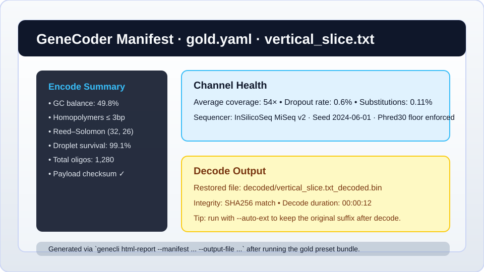

# GeneCoder

[](https://d0ttino.github.io/GeneCoder/)
[](https://codecov.io/gh/d0tTino/GeneCoder)

GeneCoder is an educational toolkit for exploring DNA-based data storage. It provides a command line interface and a GUI for encoding and decoding files into simulated DNA sequences.

For full usage instructions and additional documentation see the [docs/](docs/) directory or the hosted documentation linked above.
For instructions on launching the GUI see the [usage guide](docs/usage.md#launching-the-flet-app).
For a quick end-to-end demo see [docs/vertical_slice.md](docs/vertical_slice.md).
The configuration at `configs/pipeline_metrics.yaml` shows how to run the pipeline while recording metrics.
For deployment instructions including building the React dashboard see the
[deployment guide](docs/deployment.md).

## End-to-End CLI Example

Run the entire encode → simulate → decode loop with a single command using the gold-standard preset:

```bash
genecli bundle run configs/gold.yaml --cache-dir gold_runs
```

The preset performs GC-balanced encoding with Reed–Solomon protection, drives the MiSeq-style InSilicoSeq simulator (or the built-in Illumina fallback when `insilicoseq` is absent) and restores the payload in one pass. GeneCoder stores every artifact inside `gold_runs/<config-hash>/<timestamp>/`:

- `encoded/vertical_slice.txt.fasta` plus the automatically generated `encoded/vertical_slice.txt.manifest.json` and `.batch.json` files capture each oligo and its metadata.
- `sequence_batches.json` at the run root aggregates every emitted `SequenceBatch`, making it easy to diff runs or hand the cache to collaborators.
- `simulated/vertical_slice.txt.fasta` holds the synthetic reads from the channel stage so you can explore MiSeq coverage patterns or re-run the decode step with tweaked options.
- `decoded/vertical_slice.txt_decoded.bin` is the recovered payload produced by the default decode settings. Pass `--auto-ext` in the decode stage if you prefer the original `.txt` suffix in future custom configs.

Turn the encode manifest into a browsable report immediately after the run to deliver the “5-minute demo” experience:

```bash
genecli html-report \
  --manifest gold_runs/<config-hash>/<timestamp>/encoded/vertical_slice.txt.manifest.json \
  --output-file gold_runs/<config-hash>/<timestamp>/encoded/vertical_slice.txt.html
```



The manifest view highlights GC balance, droplet survival and homopolymer limits so you can confirm the preset behaved as expected before moving on to custom experiments. Re-run the command to refresh the cache or append `--export-archive gold_runs.tar.gz` for an easily shareable bundle complete with a `summary.json` index of cached files.

## Introductory notebooks

Introductory Jupyter notebooks with encoding and decoding examples are available in the [notebooks/](notebooks) directory. A small series of lessons covers the basics:

- [1_encoding_basics.ipynb](notebooks/lessons/1_encoding_basics.ipynb) – introduction to encoding and decoding
- [2_fec_basics.ipynb](notebooks/lessons/2_fec_basics.ipynb) – fundamentals of forward error correction
- [3_running_simulators.ipynb](notebooks/lessons/3_running_simulators.ipynb) – running simple simulators

Launch Jupyter with:

```bash
scripts/launch_jupyter.sh
```

GeneCoder's long-term goal is to provide an integrated research platform that
bridges encoding algorithms with sequencing and synthesis simulations while
remaining easy to extend. The guiding ideas are summarized in
[docs/DEVELOPMENT_VISION.md](docs/DEVELOPMENT_VISION.md).

### Disclaimer

GeneCoder is intended for educational simulations only. It should not be used to
handle personal or medical DNA data.

## Features

- Gold preset bundle at `configs/gold.yaml` for a turnkey encode → simulate → decode pipeline with MiSeq-style coverage.
- Rich SequenceBatch manifests and oligo metadata for every encode step.
- One-click HTML manifest export for dashboards, notebooks and quick-sharing demos.
- Flet-based GUI with analysis plots and an enhanced 3D helix viewer.
- Base5 and base6 alphabet options for alternative nucleotide letters. These
  modes remap the standard ACGT symbols but **do not increase capacity**.
- External read simulators can be invoked with ``--simulator``.
  Extra parameters may be supplied via ``--d2sim-options``,
  ``--dnarsim-options`` or ``--squigulator-options``. The same values can be
  provided using the environment variables ``GENECODER_D2SIM_OPTIONS``,
  ``GENECODER_DNARSIM_OPTIONS`` and ``GENECODER_SQUIGULATOR_OPTIONS``.

### Experimental / Extras

> These integrations rely on optional extras and are still stabilising, so expect API shifts between releases.

- Advanced FEC modules such as LDPC, Fountain and RaptorQ (install via Poetry extras).
- AI-assisted decoding through DNAformer and DeepDNA plugins.
- MPI-based pipeline distribution as documented in [docs/mpi.md](docs/mpi.md).

## Usage Metrics

GeneCoder tracks how many oligos are simulated each ISO week. The aggregated
count is stored as ``oligos_per_week`` and serves as the project's key usage
metric. See [docs/metrics.md](docs/metrics.md) for more details.

## Quick Start

GeneCoder requires **Python 3.11+** and uses
[Poetry](https://python-poetry.org/) for dependency management. Install the
dependencies with:

```bash
poetry install --no-interaction
```

GUI and web features are optional. Install their dependencies with:

```bash
poetry install --with gui,web --no-interaction
```

Additional plugins such as DNAformer or FrameD can be installed via
Poetry's ``--extras`` flag:

```bash
poetry install --extras dnaformer --extras framed --no-interaction
```

GeneCoder now uses a single `poetry.lock` across Linux, macOS and Windows.
Previous OS-specific lock files have been removed and the unified lock file
should be used on all platforms.

### Extras Required for the Full Test Suite

Install the following extras to enable all optional features exercised by the
test suite:

| Extras        | Provides                                        |
|---------------|-------------------------------------------------|
| `gui`         | Flet GUI and helix viewer dependencies          |
| `web`         | FastAPI server for the web dashboard            |
| `dev`         | Pytest, Ruff, MyPy, types-PyYAML and Playwright tools |
| `ldpc`        | Low-density parity-check codes                  |
| `fountain`    | Fountain code support                           |
| `bch`         | BCH error-correcting codes                      |
| `raptorq`     | RaptorQ FEC algorithms                          |
| `framed`      | FrameD C++ backend                              |
| `dnaformer`   | DNAformer AI codec                              |
| `deepdna`     | DeepDNA FEC plugin                              |

Install all groups required for development and testing with:

```bash
poetry install --with gui,web,dev \
  --extras ldpc --extras fountain --extras bch \
  --extras raptorq --extras framed --extras dnaformer \
  --extras deepdna --no-interaction
```

Installing all extras downloads many large packages such as Flet and
framework backends. Expect the installation to consume around **2&nbsp;GB** of
disk space and take roughly **10&nbsp;minutes** on a typical broadband
connection.

For running GeneCoder without any network access see the [offline usage guide](docs/offline_usage.md) and the [offline setup notes](docs/installation.md#offline-setup).


Desktop packages are available on the [releases page](https://github.com/d0tTino/GeneCoder/releases).
Download the `.msix` file for Windows or the `.dmg` for macOS and follow your
platform's standard installation prompts.


See [docs/installation.md](docs/installation.md) for detailed setup and testing instructions, including the [mamba-based setup](docs/installation.md#mamba-based-setup) and the [Windows Quick Start](docs/installation.md#windows-quick-start).
- For a quick end-to-end demo see [docs/vertical_slice.md](docs/vertical_slice.md).
- For working inside the VS Code Dev Container see [docs/installation.md#using-the-dev-container](docs/installation.md#using-the-dev-container).

## Development Setup

Install the project in editable mode with development tools:

```bash
poetry install --with gui,web,dev --no-interaction
```

You can also run the helper script to install all optional extras
required by the full test suite:

```bash
scripts/install_extras.sh
```

## Running Tests

Install the development dependencies before executing the test suite:

```bash
poetry install --with dev --no-interaction
poetry run pytest -q
```

Run MyPy after installing the same `dev` extras so stub packages like
`types-PyYAML` are available:

```bash
python -m pip install -e .[dev]
mypy --config-file pyproject.toml --show-error-codes
```


The helper script above installs every extras group, enabling the
full test matrix.

## Parallel Execution

`ChannelPipeline` can execute steps concurrently. Set
`parallel=True` in `ChannelConfig` and choose a `workers` count. Adding
`use_mpi=True` enables distributed runs. See
[docs/parallel.md](docs/parallel.md) for more options and CLI tips. Multi‑node
instructions live in [docs/mpi.md](docs/mpi.md). MPI support requires the
`mpi4py` package and an MPI implementation (MPICH or OpenMPI) but is optional
for local or offline use.


## Continuous Integration

GitHub Actions run linting and tests whenever source code changes. Documentation
or comment-only updates skip the heavy jobs, keeping CI usage efficient.

## Contributing

Contributions are welcome! Please read [CONTRIBUTING.md](CONTRIBUTING.md) for guidelines.

GeneCoder is released under the [MIT License](LICENSE).

See [CITATION.cff](CITATION.cff) for citation information.

### Plugins

GeneCoder can be extended through plugins discovered via the
`genecoder.plugins`, `genecoder.fec` and `genecoder.simulators` entry points.
Sample implementations include
[`src/plugins/reverse_codec.py`](src/plugins/reverse_codec.py) and
[`src/plugins/helix_visualizer.py`](src/plugins/helix_visualizer.py).
See the step-by-step
[codec](docs/plugins.md#codec-plugin-walkthrough),
[FEC](docs/plugins.md#fec-plugin-walkthrough) and
[simulator](docs/plugins.md#simulator-plugin-walkthrough) examples in
[docs/plugins.md](docs/plugins.md) for interface expectations and details on
writing and registering new codecs, FEC back-ends or simulators. Minimal
templates live in `plugins-examples/encoder_template` and
`plugins-examples/channel_template`. Plugins are automatically loaded when
using the CLI or GUI. When using GeneCoder as a library call
``genecoder.plugins.load_plugins()`` first to populate the registries.
GeneCoder follows an offline-first design: without a registry URL only plugins
already installed in the environment are loaded. See the [offline usage guide](docs/offline_usage.md) for environment flags and registry opt-in details.

Remote plugin sources can be configured via the environment variables
``GENECODER_PLUGIN_REGISTRY_URL`` and ``GENECODER_PLUGIN_CATALOG_URL``. Set
``GENECODER_PLUGIN_REGISTRY_URL`` to a YAML file with package names to install
via the ``genecli plugin install-registry`` command (or the
:func:`genecoder.plugins.install_registry_plugins` function) and ``GENECODER_PLUGIN_CATALOG_URL`` to a JSON or YAML catalog
used by the ``genecli plugin`` commands. The catalog URL may be an HTTP(S)
address or a local file via ``file://``.

```bash
export GENECODER_PLUGIN_REGISTRY_URL=https://example.com/registry.yaml
export GENECODER_PLUGIN_CATALOG_URL=https://example.com/catalog.yaml
```

GeneCoder works fully offline unless these variables are set. Plugins are loaded
from packages already installed in the current Python environment. No network
requests are made by the plugin manager when the registry and catalog URLs are
unset. For air‑gapped deployments set them to empty strings to disable remote
lookups entirely:

```bash
export GENECODER_PLUGIN_REGISTRY_URL=
export GENECODER_PLUGIN_CATALOG_URL=
```

Install registry packages with:

```bash
genecli plugin install-registry --allow-registry
```

The `--allow-registry` flag is required to opt in to downloading and
executing third-party code. Only use registries from trusted sources.
Every registry entry must include either a `checksum` or a `signature`
which is verified during installation. Set `GENECODER_PLUGIN_PUBLIC_KEY`
to the public key path when using signatures.

For details on submitting scores to the plugin challenge and viewing the
leaderboard interface see the
[Challenge Scoreboard](docs/plugins.md#challenge-scoreboard) section.

### Web Server Environment Variables

Several environment variables control optional behaviour of the FastAPI server:

- `GENECODER_REDIS_URL` – URL to a Redis instance used for request rate
  limiting. When set, the server initializes `fastapi-limiter` with this Redis
  backend and enforces a basic limit of 5 requests per second on chunk upload
  and download endpoints. If unset, no rate limiting is applied.
- `GENECODER_RATINGS_PATH` – file path for storing plugin rating information.
  Ratings submitted via the `/plugins/rate` endpoint are loaded from and written
  back to this JSON file on server shutdown, letting ratings persist between
  restarts. Ratings can be fetched with `GET /plugins/rate`.
- `GENECODER_CORS_ORIGINS` – comma-separated list of allowed origins for
  Cross-Origin Resource Sharing (CORS). The default `*` permits requests from any
  origin. Restrict this variable to limit which web clients may call the API.
- `GENECODER_DATA_DIR` – directory used to cache simulator profiles
  (default `~/.genecoder/data`).
- `GENECODER_PROFILE_DIR` – optional path with pre-downloaded profiles for
  running simulators offline.
