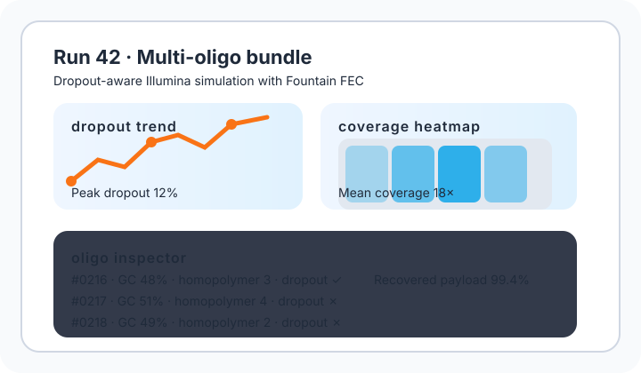

# GUI Tutorial

This tutorial shows how to launch the Flet-based graphical interface.

## Installation

```bash
pip install genecoder[gui]
```
This installs the optional `gui` extras which pull in Flet, Matplotlib and
`flet-webview`.

## Running the application

```bash
python -m genecoder.flet_app
```

The application window contains three main tabs:

1. **Encode** – choose an input file, encoding method and optional FEC.
2. **Decode** – select a FASTA file to decode and configure error simulation.
3. **Visualizer** – render the resulting DNA sequence in 3D. See the
   [Helix Frontend guide](helix_frontend.md) for viewer options.

The Encode tab includes a **Mirror** checkbox to output the reverse-complement
alongside the main sequence. Toggle this on to view both strands together in the
Visualizer.
Drag files onto the Encode tab or use the **Browse File** button to select an
input file.



Use the buttons at the bottom of each tab to start the selected operation. The updated dashboard highlights per-oligo dropout flags, coverage heatmaps and recovery percentages so you can see how the multi-oligo pipeline behaves immediately after a run.

After encoding completes, GC and homopolymer metrics are shown. The app uses the
same enforced defaults as the CLI (45–55% GC and a three-base homopolymer cap).
If a sequence violates those guardrails, a **Fix Sequence** button allows
automatic adjustment. Clicking it displays the fixed DNA snippet and updated
metrics.

Example: encode any file, then click **Fix Sequence** when the suggestion text appears to view the corrected sequence.

## Launching the Streamlit Dashboard

GeneCoder also ships with a simple Streamlit dashboard for exploring simulation metrics. After installing the `gui` extras, run:

```bash
genecli dashboard examples/dashboard_metrics.json
```

The dashboard visualizes the sample metrics file and plots GC distribution, homopolymer statistics and decode success rates.

## Comparing Illumina and Nanopore Runs

The dashboard accepts multiple metrics files, allowing side-by-side comparison
of different sequencing technologies. Launch it with two results files to
overlay GC distributions and group ECC success rates:

```bash
genecli dashboard examples/illumina_metrics.json examples/nanopore_metrics.json
```

The combined view highlights differences such as error profiles or GC balance
between Illumina and Nanopore simulations.
